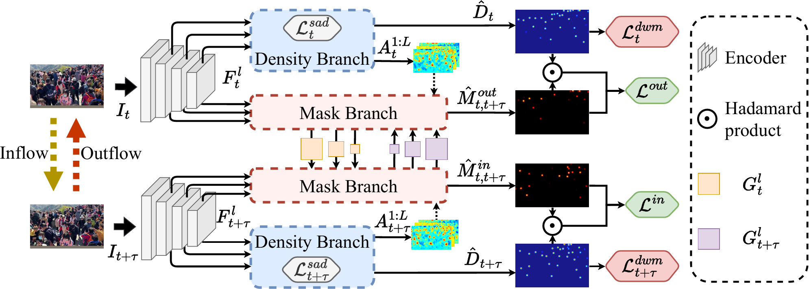

# DAANet

The official implementation of "Density-assisted Adaptive Alignment Network for Crowd Flux Estimation".



# Installation

* Clone this repo in the directory ```root/DAANet/src/``` 
    ```bash
    cd root/DAANet/src
    git clone https://github.com/LeoHuang0511/DAANet.git
    ```

* Create and activate the envirnment
    ```bash
    cd root/DAANet/
    pip install virtualenv
    virturalenv DAANet_env
    source ./DAANet_env/bin/activate
    ```

* Install the dependencies (Python 3.8.10, PyTorch 2.1.2)
    ```bash
    pip install -r requirements.txt
    ```

# Datasets

* **SenseCrowd**: 
    1. Download SenseCrowd from [Baidu disk](https://pan.baidu.com/s/1OYBSPxgwvRMrr6UTStq7ZQ?pwd=64xm).
    2. Download the original dataset form [here](https://github.com/HopLee6/VSCrowd-Dataset) and the lists of `train/val/test` sets at [link1](https://1drv.ms/u/s!AgKz_E1uf260nWeqa86-o9FMIqMt?e=0scDuw) or [link2](https://pan.baidu.com/s/13X3-egn0fYSd6NUTxB4cuw?pwd=ew8f), and place them to each dataset folder, respectively.  
* **CroHD**: Download CroHD from [here](https://motchallenge.net/data/Head_Tracking_21/). 
* **CARLA**: Download CARLA from [here](https://drive.google.com/file/d/1hycxlqE66QGXsOo-HMWyi3WUlF2TII8r/view?usp=sharing).

# Pretrained Weights

* **SenseCrowd**: The weights trained with Sensecrowd can be download from [here](https://nycu1-my.sharepoint.com/:u:/g/personal/s311505011_ee11_m365_nycu_edu_tw/EQfMAYoBPG5Ktzc4WH1-CfUBfAhAwSk6gXg_966AaK2JWg?e=ihvEt6)
* **CroHD**: The weights trained with CroHD can be download from [here](https://nycu1-my.sharepoint.com/:u:/g/personal/s311505011_ee11_m365_nycu_edu_tw/ES8yXi_5C1xLjbHZ2nq2G4YBmDmjTce2NrzwDCrNRyNxtQ?e=dAzWgN)
* **CARLA**: The weights trained with CARLA can be download from [here](https://nycu1-my.sharepoint.com/:u:/g/personal/s311505011_ee11_m365_nycu_edu_tw/ESyo__dWEKxAr_nT756mJiwBmx856KrvgSiRWJWd_6z6Nw?e=bvF4r1)

# Preparation

Put the downloaded datasets in the directory ```root/datasets/```, forming the folder structure like:
```
root
├──DAANet
│   └──src
├──exp
│   └──pretrained
│       ├──SensCrowd.pth
│       ├──CroHD.pth
│       └──CARLA.pth
└──datasets
    ├──SensCrowd
    ├──CroHD
    └──CARLA
     
```

# Training

* Run the following command to train your own model:
    ```bash
    python train.py --DATASET SENSE --GPU_ID 0
    ```
* The checkpoints would be saved in ```root/DAANet/exp/```.
* Replace ```--DATASET``` to ```HT21``` or ```CARLA``` to change the training dataset.

# Testing

* Run the following command to test the model pretrained on SenseCrowd:
    ```bash
    python test_SENSE.py --MODEL_PATH ../exp/pretrained/SenseCrowd.pth --GPU_ID 0
    ```
* Replace ```test_SENSE.py``` to ```test_HT21.py``` or ```test_CARLA.py``` to test the model trained on CroHD or CARLA.
* Change ```--MODEL_PATH``` to load other pretrained weights.

